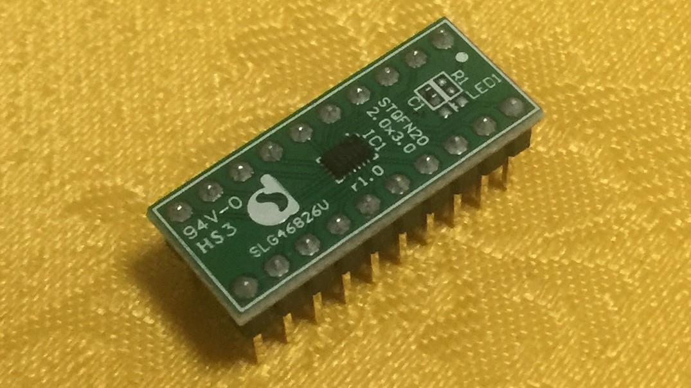
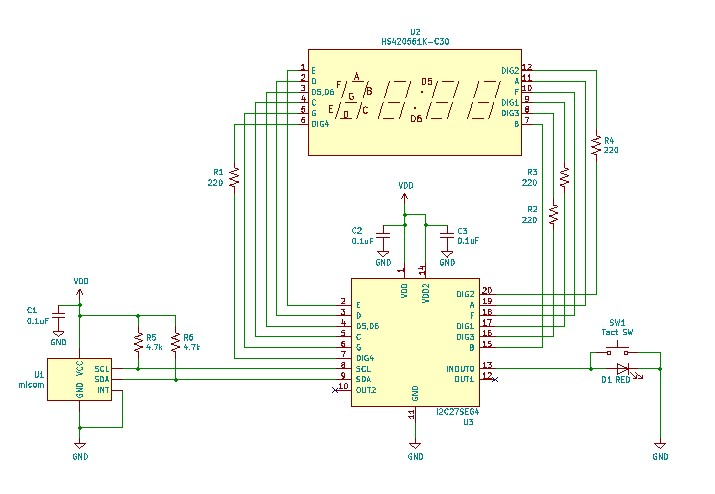
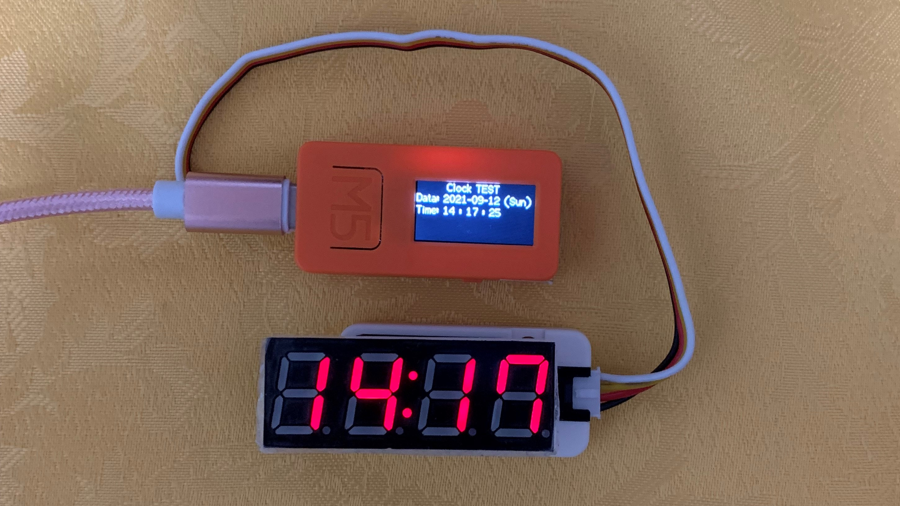
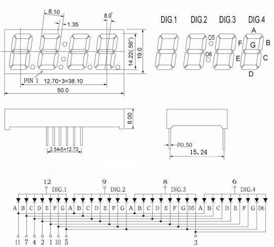
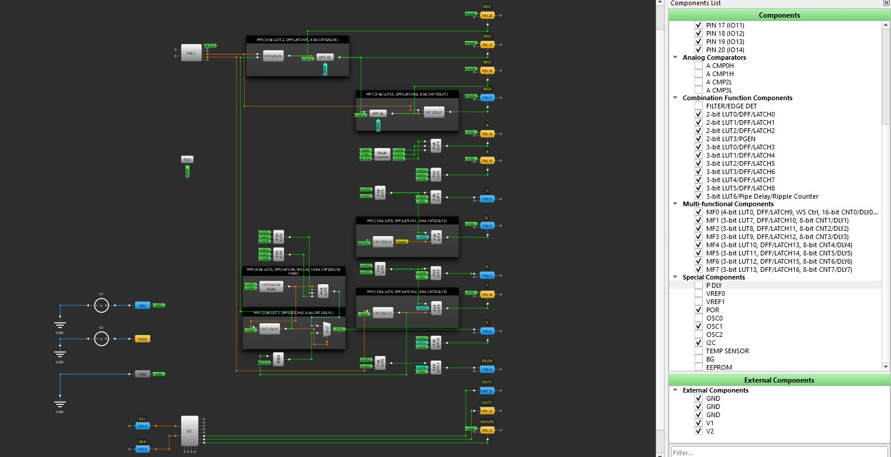

# I2C to 7SEGx4, GPIO using GreenPAK. (緑豆弐拾壱號)  
  
GreenPAK用のデザインデータです。  
I2Cインタフェースで12ピンの4桁7セグメントLEDの制御を可能にします。同時にGPIOをサポートします。  
SLG46826V(STQFN) または SLG46826G(TSSOP) に対応しています。SLG46826V-DIPに焼くこともできます。   

  

## 機能
- I2Cで4桁7セグメントLED の任意セグメントをON/OFF可能  
- 明るさの調整が可能
- ダイナミック制御方式のため、点灯セグメント数によらず明るさをほぼ一定にすることが可能
- １個のGPIO端子（INOUT0)と２個のGPO端子（OUT1,2)が利用可能  
- GPO端子は10kΩ Pull-up抵抗を内蔵しているので、LEDを直結可能  
- GPIO端子は10kΩ Pull-up抵抗を内蔵しているので、スイッチやLEDを直結可能  

## 応用回路図
### 設計内容
- 4桁7セグメントLEDの任意セグメント制御に対応
- LEDつきスイッチの入力に対応

  

### 設計内容の補足
- DIG1～DIG4につける抵抗値は、電源電圧やLEDの明るさに応じて適宜変更してください。抵抗なしでも動作しますが、GreenPAKが壊れる恐れがあるため、電流は20mA以下にすることをお勧めします。例えば、5Vで赤色LED(VF=1.8V)を制御するときは160Ω以上とします。

## 接続例
デバッグ用にM5StickCに接続した例。  
GreenPAKを使ったモジュールに7SEGモジュールをかぶせるように挿すことで、配線を最少化しています。  

  

## ピンアサイン
ピン配置及び制御論理は時計用4桁7セグメントLED HS420561K-C30（カソードコモン） 向けに設計してあります。  

  

### I2C27SEG4 
STQFN Pin # | TSSOP Pin # | 機能名 | IO | 内蔵抵抗 | SLG46826端子名 | 機能
--- | --- | --- | --- | --- | --- | ---
1 | 20 | VDD |  |  | VDD |  2.3V～5.5V
2 | 19 | E | O | - | IO0 | segment
3 | 18 | D | O | - | IO1 | segment
4 | 17 | D5,D6 | O | - | IO2 | segment
5 | 16 | C | O | - | IO3 | segment
6 | 15 | G | O | - | IO4 | segment
7 | 14 | DIG4 | I/O | - | IO5 | Common cathode 4
8 | 13 | SCL | I | - | SCL | SCL for SLG46826
9 | 12 | SDA | I/O | - | SDA | SDA for SLG46826
10 | 11 | OUT2 | O | PU10k | IO6 | GPO
11 | 10 | GND |  |  | GND |  GND
12 | 9 | OUT1 | O | PU10k | IO7 | GPO
13 | 8 | INOUT0 | I/O | PU10k | IO8 | GPIO or BEEP
14 | 7 | VDD2 |  |  | VDD2 |  2.3V～5.5V
15 | 6 | B | O | - | IO9 | segment
16 | 5 | DIG3 | O | - | IO10 | Common cathode 3
17 | 4 | DIG1 | O | - | IO11 | Common cathode 1
18 | 3 | F | O | - | IO12 | segment
19 | 2 | A | O | - | IO13 | segment
20 | 1 | DIG2 | I/O | - | IO14 | Common cathode 2

### 内蔵抵抗
GPIOまたはGPO端子の内蔵抵抗を有効にしていますので、外付け抵抗を省略できます。  
記号はおおよその抵抗値を表しており、値は以下の通りです。  
- PU10k: Pull-up 10k ohm  
  
## コントロールレジスタ
I2Cアドレスは、0x08～0x0Bです。  
※I2Cアドレスを変更するには設計ツールでI2Cのプロパティを書き換えてください。  
I2Cアドレス0x08のI2Cレジスタを書き換えることでデバイスの動作を制御できます。  
I2Cアドレス0x09を用いても同じ動作になります。
I2Cアドレス0x0A~0x0Bは回路書換用に予約されていますので、不用意にアクセスを行わないでください。  
  
### コントロールレジスタ一覧
レジスタ一覧を下記に示します。  
  
address | W/R | default| bit | Definition 
--- | --- | --- | ---| ---
0x74 | R | -- | [7] | INOUT0 input value 0: Low, 1: High
 | | | | [6:0] | *Reserve*
0x7A | W | 0x00 | [7:3] | *Reserve*
 | | | | [2] | OUT2 port control  0: output Low, 1: output & Pull-up
 | | | | [1] | OUT1 port control  0: output Low, 1: output & Pull-up
 | | | | [0] | INOUT0 port control  0: input & Pull-up, 1: output Low
0x92 | W | 0xFF | [7:0] | 7segment data for digit1 [7]: A [6]: B [5]: C [4]: D [3]: E [2]: F [1]: G [0]: don't care
0x93 | W | 0xFF | [7:0] | 7segment data for digit2 [7]: A [6]: B [5]: C [4]: D [3]: E [2]: F [1]: G [0]: don't care
0x94 | W | 0xFF | [7:0] | 7segment data for digit3 [7]: A [6]: B [5]: C [4]: D [3]: E [2]: F [1]: G [0]: D5
0x95 | W | 0xFF | [7:0] | 7segment data for digit4 [7]: A [6]: B [5]: C [4]: D [3]: E [2]: F [1]: G [0]: D6
0xAF | W | 0x07 | [7:0] | Brightness max : 7 min : 61 off : 62
0xC8 | W | 0x00 | [7:0] | Software reset 0x02: reset
    
## 表示データ設定
光らせるセグメントに対応するビットに１を設定することで任意の記号を表示できます。  
digit1～digit4は左からの各桁に対応しています。  
0～9に対応するHEX値の例を以下に示します。  
アルファベットなど他の例は、I2C27SEG4.xlsx をご参照ください。  

char|ASCII code|A|B|C|D|E|F|G|DP|DEC|HEX
---|---|---|---|---|---|---|---|---|---|---|---
0|48|1|1|1|1|1|1|0|0|252|FC
1|49|0|1|1|0|0|0|0|0|96|60
2|50|1|1|0|1|1|0|1|0|218|DA
3|51|1|1|1|1|0|0|1|0|242|F2
4|52|0|1|1|0|0|1|1|0|102|66
5|53|1|0|1|1|0|1|1|0|182|B6
6|54|1|0|1|1|1|1|1|0|190|BE
7|55|1|1|1|0|0|1|0|0|228|E4
8|56|1|1|1|1|1|1|1|0|254|FE
9|57|1|1|1|1|0|1|1|0|246|F6

charもしくはASCII codeに対応するHEX値をコントロールレジスタに設定してください。  
コロンを表示する際は、digit3とdigit4の設定値に1を足してください。  

## GPO
OUT1, OUT2  
コントロールレジスタを設定することで、GPOの出力信号をLow出力、またはPull-up出力にすることができます。  
通常のLow/High出力として使えるほか、LEDをつなぎ反対側をGNDにつなぐことでLEDのON/OFFが可能です。（1で点灯）  
  
### 使用例１
GPO端子を他のICの入力端子につなぐ。  
- 初期状態または0を設定するとLOW出力、1を設定するとHigh出力となる。  

### 使用例２ 
GPO端子にLEDをつなぎ、LEDの反対側をGNDにつなぐ。  
- 初期状態ではLEDが消灯する。  
- レジスタに1を設定すると、LEDが点灯する。  
- レジスタに0を設定すると、LEDが消灯する。

## GPIO
INPUT0  
コントロールレジスタを設定またはリードすることで、GPIOを用いた入出力を行えます。  
0を設定すると、入力かつPull-up、1を設定するとLowを出力するように動作します。  

### 使用例１
GPIO端子を他のICの入力端子につなぐ。  
- 初期状態または0を設定するとHigh出力、1を設定するとLow出力となる。（負論理であることに注意）  

### 使用例２
GPIO端子にLEDをつなぎ、LEDの反対側をGNDにつなぐ。  
- 初期状態ではLEDが点灯する。  
- レジスタに1を設定すると、LEDが消灯する。  
- レジスタに0を設定すると、LEDが点灯する。（負論理であることに注意）  

### 使用例３ (応用回路図参照）
GPIO端子にプッシュスイッチとLEDをつなぎ、スイッチとLEDの反対側をGNDにつなぐ。  
- 初期状態ではLEDが点灯する。  
- 初期状態またはレジスタに0を設定したときは、プッシュスイッチの状態をリードすることができる。また、スイッチを離している間はLEDが点灯し、スイッチを押している間はLEDが消灯する。  
- レジスタに1を設定すると、LEDが常時消灯となる。

## 明るさ
コントロールレジスタのアドレス0xAFで明るさを変えられます。7で明るさ最大、61で明るさ最小、62で消灯です。  

## ソフトウェアリセット
コントロールレジスタのアドレス0xC8に0x02を書き込むことで、SLG46826にリセットをかけることができます。  
リセット後はSLG46826が初期化され、端子設定やレジスタ設定などが初期状態に戻ります。  
リセット状態は自動的に解除されるので、0x00を送りなおす必要はありません。  
  
## 設計データ
「GreenPAK6 Designer」で  
I2C27SEG4.gp6  
を開き、SLG46826V またはSLG46826Gに焼いてください。  
端子アサイン、プルアップ／プルダウン抵抗、ドライブ能力などはお好きに変更して下さい。 
SLG46826G に焼く場合は、File-Project info で Packageを「TSSOP-20」に変更してください。この場合、LEDと端子の対応が左右反転しますが、ピッチ変換基板を裏返しに使うなどSLG46826Gを左右反転にすることで、設計データをそのまま使うことができます。  

設計データ外観  
  

### アノードコモンへの対応（仮）
I2C27SEG4A.gp6  
をお使いください。
本設計は動作検証を行っておりません。レポートをお待ちしております。

## 免責事項
当方は、利用者に対して、このデザインおよびこの資料（以下、本デザイン等）に関する当方または第三者が有する著作権、特許権、商標権、意匠権及びその他の知的財産権をライセンスするものではありませんし、本デザイン等の内容についていかなる保証をするものでもありません。また当方は、本デザイン等を用いて行う一切の行為について何ら責任を負うものではありません。本デザイン等の情報の利用、内容によって、利用者にいかなる損害、被害が生じても、当方は一切の責任を負いません。ご自身の責任においてご利用いただきますようお願いいたします。   
  
  
## Author  
[GitHub/AoiSaya](https://github.com/AoiSaya)  
[Twitter ID @La_zlo](https://twitter.com/La_zlo)  
